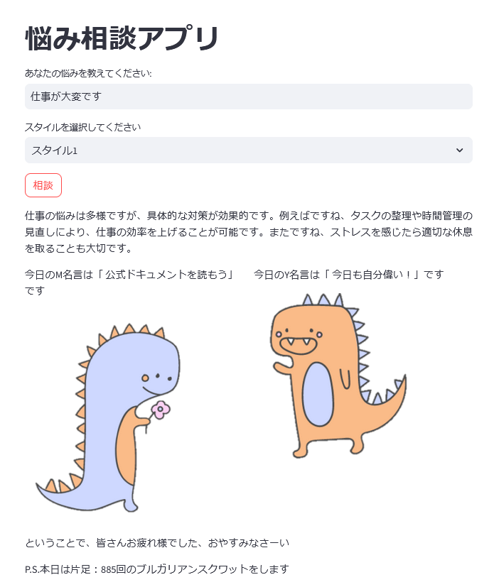

# 成果物集

<table>
<tr>
<td>

</td>
<td style='vertical-align: top; padding-left: 20px;'>
<h3>よしなにアプリ</h3>

講師の方の口調で悩み相談に答えてくれて、名言で励ましてくれるアプリです。

<ul>
<li><a href='https://yosinani-mrp9bnhaovfewmy9lumeru.streamlit.app/'>アプリのページ</a></li>
<li><a href='https://github.com/kzsr0w0/yosinani'>ソースコード</a></li>
</ul>
</td>
</tr>
</table>